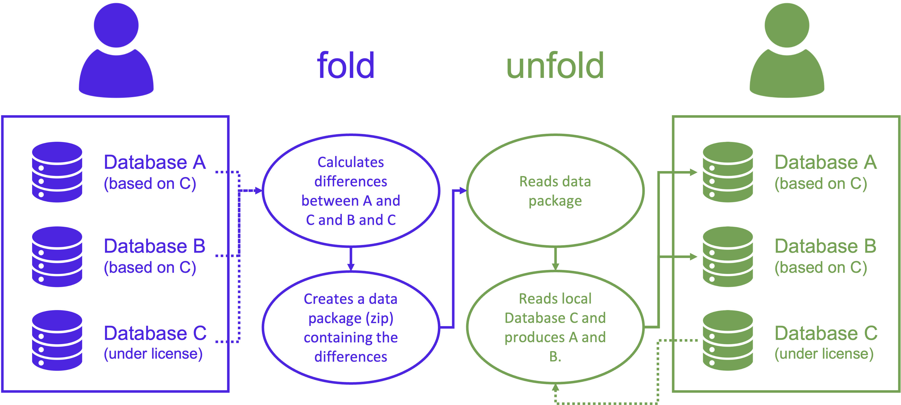

# `unfold`

<p align="center">
  <a href="https://badge.fury.io/py/unfold" target="_blank"></a>
  <a href="https://github.com/romainsacchi/unfold" target="_blank"></a>
</p>

公开共享数据包，允许基于有许可的数据重现 LCA（生命周期评估）数据库。

如果你使用本软件，请引用以下文章：

Sacchi, R., (2023). unfold: removing the barriers to sharing and reproducing prospective life-cycle assessment databases. 
Journal of Open Source Software, 8(83), 5198, https://doi.org/10.21105/joss.05198

## `unfold` 是什么？

`unfold` 是一个 Python 包，允许对从源数据库（例如 ecoinvent）派生的 LCA 数据库进行“fold（折叠）”和“unfold（展开）”，同时不暴露其所基于的受许可限制的数据。



本包的目的是允许用户公开共享 LCA 数据库，而在源数据库受限许可的情况下不直接共享源数据库本身。因此，`unfold` 允许用户分享数据包，该数据包可使其他用户在拥有源数据库的前提下重现 LCA 数据库。

它基于 [brightway2](https://brightway.dev) 框架构建。

`unfold` 最初用于分享由 `premise` 生成的数据库（[链接](https://github.com/polca/premise)），或任何其他在很大程度上被修改并基于受限许可基础（如 ecoinvent）的数据库。

## 限制

* 目前仅支持 `brightway2`
* 仅在 ecoinvent 3.6、3.7 和 3.8 上测试过（但原则上应可与其他源数据库配合使用）


## 使用说明

### 安装

`unfold` 可在 PyPI 上获得，可使用 `pip` 安装：

    pip install unfold

或者，你也可以克隆仓库并从源码安装：

    git clone https://github.com/polca/unfold.git
    cd unfold
    pip install -e .

也可以通过 conda 安装：

    conda install -c romainsacchi unfold


### 用法

另请参阅 `examples` 文件夹中的示例笔记本。

#### fold（折叠）

`unfold` 可以将多个 brightway2 数据库“折叠”成单个数据包。数据包是一个 zip 文件，包含相对于某个源数据库的数据库差异（包括额外的清单），以及描述这些数据库及其内容的元数据文件。

```python
from unfold import Fold
import bw2data

# 包含源数据库和要折叠的数据库的 brightway 项目名称
bw2data.projects.set_current("some BW2 project")

f = Fold()
f.fold()
```

生成的数据包会保存在当前目录，并可与其他用户共享。

#### unfold（展开）

`unfold` 可以将数据包“展开”成一个或多个 brightway2 数据库。

```python
from unfold import Unfold
import bw2data

# 包含源数据库和要展开的数据库的 brightway 项目名称
bw2data.projects.set_current("some BW2 project")

u = Unfold("a package name.zip")
u.unfold()
```

传递给 `Unfold` 类的文件路径可以是绝对路径、相对于当前目录的相对路径，或甚至是 URL。


#### 展开成可与 Activity Browser 一起使用的超结构数据库

`unfold` 可以将数据包展开成可与 [Activity Browser](https://github.com/LCA-ActivityBrowser/activity-browser) 一起使用的超结构数据库。

```python
from unfold import Unfold
import bw2data

# 包含源数据库和要展开的数据库的 brightway 项目名称
bw2data.projects.set_current("some BW2 project")

u = Unfold("a package name.zip")
u.unfold(superstructure=True)
```

这将在你的 brightway2 项目中输出一个超结构数据库，并在当前工作目录中生成一个场景差异文件（Excel 格式）。

## 贡献

Unfold 是一个开源项目，欢迎贡献。要为项目贡献，请在项目的 GitHub 页面上创建一个 pull request。在提交 pull request 之前，请确保你的更改有适当的文档并且所有测试通过。

## 问题报告

如果你遇到任何问题，请在项目的 GitHub 页面上打开 issue。请包含能重现问题的最小可运行示例。如果你在报告错误，请包含你使用的包版本。

## 支持

如果你需要使用 Unfold 的帮助，请联系作者（见下文）。


## 作者

[Romain Sacchi](mailto:romain.sacchi@psi.ch), PSI

## 许可证

Unfold 在 MIT 许可证下发布。
有关详细信息，请参见 [License](https://github.com/polca/unfold/blob/main/LICENSE) 文件。
