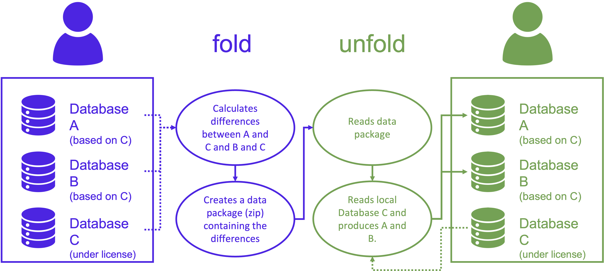

# `unfold`

<p align="center">
  <a href="https://badge.fury.io/py/unfold" target="_blank"></a>
  <a href="https://github.com/romainsacchi/unfold" target="_blank"></a>
</p>

Publicly share data packages that allow reproducing LCA databases
based on licensed data.

## What does `unfold` do?

``unfold`` is a Python package that allows "folding" and "unfolding"
LCA databases derived from a source database (e.g., ecoinvent) without
exposing the licensed data it builds from.



The purpose of this package is to allow users to publicly share 
LCA databases without sharing the source database, in the case
where the latter is under restrictive license. Hence, ```unfold``` 
allows users to share instead data packages that allows other users
to reproduce the LCA database (provided they have the source database).

It is based on the [brightway2](https://brightway.dev) framework.

`unfold` is initially conceived to share `premise`-generated 
databases ([link](https://github.com/polca/premise)), or any other
databases that have been heavily modified and derived
from a base which is under 
restrictive licensing (i.e., ecoinvent).

## Limitations

* only works with `brightway2` at the moment
* only tested wih ecoinvent 3.6, 3.7 and 3.8 (but should be working with any other source database in principle)


## How to

### Install

`unfold` is available on PyPI and can be installed with `pip`:

    pip install unfold

Alternatively, you can clone the repository and install the library from the source code:

    git clone https://github.com/polca/unfold.git
    cd unfold
    pip install -e .

It can also be installed from ``conda``:

    conda install -c romainsacchi unfold


### Use

See also examples notebooks in the `examples` folder.

#### fold

``unfold`` can "fold" several brightway2 databases
into a single data package. The data package is a zip file
containing the differences of the databases in relation
to a source database (including extra inventories), 
as well as a metadata file that describes the databases 
and their content.

```python

    from unfold import Fold
    import bw2data
    
    # name of the brightway project containing 
    # both the source database and the databases to fold
    bw2data.projects.set_current("some BW2 project")
    
    f = Fold()
    f.fold()
```

The resulting data package is saved in the current directory
and can be shared with other users.

#### unfold

``unfold`` can "unfold" a data package into one or several 
brightway2 databases.

```python

    from unfold import Unfold
    import bw2data
    
    # name of the brightway project containing 
    # both the source database and the databases to unfold
    bw2data.projects.set_current("some BW2 project")
    
    u = Unfold("a package name.zip")
    u.unfold()
```

The file path given to the `Unfold` class can be either
absolute or relative to the current directory, or even a URL.


#### unfold a superstructure database (to be used with Activity Browser)

``unfold`` can "unfold" a data package into a superstructure database
that can be used with the [Activity Browser](https://github.com/LCA-ActivityBrowser/activity-browser).

```python

    from unfold import Unfold
    import bw2data
    
    # name of the brightway project containing 
    # both the source database and the databases to unfold
    bw2data.projects.set_current("some BW2 project")
    
    u = Unfold("a package name.zip")
    u.unfold(superstructure=True)
```

This outputs a superstructure database in your brightway2 project,
as well as a scenario difference file (Excel) in the current working
directory.

## Contributing

Unfold is an open-source project, and contributions are welcome.
To contribute to the project, please create a pull request on the project's 
GitHub page. Before submitting a pull request, please make sure that 
your changes are properly documented and that all tests pass.

## Issues

If you encounter any problems, please open an issue on the project's
GitHub page. Please include a minimal working example that reproduces
the problem. If you are reporting a bug, please include the version
of the package you are using.

## Support

If you need help using Unfold, please contact the author (see below).


## Author

[Romain Sacchi](mailto:romain.sacchi@psi.ch), PSI

## License

Unfold is released under the MIT License.
See the [License](https://github.com/polca/unfold/blob/main/LICENSE) file for more information.

